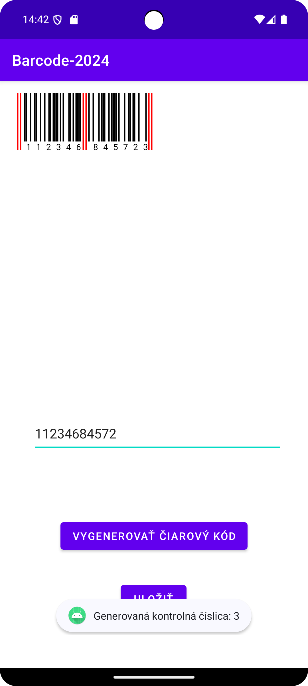

# 📦 Barcode2024 — UPC/EAN Barcode Generator (Android)

**Barcode2024** is an Android application that generates **UPC-A / EAN** barcodes from user input.  
The app allows you to enter 11 digits, automatically calculates the **check digit**, draws the barcode using a custom view, and lets you **save the barcode as an image**.

---

## 🖼️ Screenshots

  

---

## ⚙️ Tech Stack

- **Java (Android)** — Activities, Custom Views, Canvas drawing  
- **Custom View (`BarcodeView`)** — draws barcodes using binary patterns for digits  
- **MediaStore API** — save generated barcode as an image to gallery  
- **Android SDK 35** (minSdk 24, targetSdk 35)  

---

## 🎮 Features

- Enter **11 digits** into the input field  
- **Check digit calculation** (UPC-A standard)  
- Render barcode on screen with a **custom view**  
- **Save barcode as image** (JPEG) into gallery  
- Validation (only accepts exactly 11 digits)  
- Simple UI with buttons: **Generate** and **Save**  

---

## 🛠️ Build & Run

1. Open the project in **Android Studio**.  
2. Check that you have **Android SDK 35** installed (`minSdk 24`).  
3. Run on an emulator or real device.  
4. Usage:  
   - Enter **11 digits**  
   - Tap **Generate** → barcode will be drawn  
   - Tap **Save** → barcode will be exported to gallery as `.jpg`  

---

## 📐 Check Digit Algorithm

The app uses the **UPC-A check digit calculation**:  
- Multiply odd-position digits by 3  
- Add even-position digits  
- Find the sum modulo 10  
- The check digit is `(10 - (sum mod 10)) mod 10`  

---

## 🧑‍💻 Author

Created by **Adam Kuchár**  

